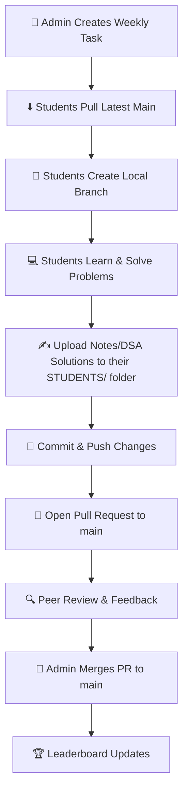

# 🎯 Placement Preparation Community Workspace

[](https://github.com/sarathi-sai7/Placement-Preparation)
[](https://github.com/sarathi-sai7/Placement-Preparation/graphs/contributors)
[](http://makeapullrequest.com)
[](https://opensource.org/licenses/MIT)

Welcome to the **Placement Preparation Community Workspace**! This repository serves as the central collaborative hub for our group of **45 students** dedicated to mastering Data Structures & Algorithms (DSA), Aptitude, Core Computer Science subjects, and preparing for upcoming placement seasons. 

---

## 🌟 Purpose & Community Goals

Preparing for placements is a marathon, not a sprint. By working together in this repository, we aim to:
- **Build Consistency:** Keep each other accountable through weekly tasks and tracked progress.
- **Share Knowledge:** Consolidate premium resources, high-quality notes, and seminar materials in one searchable place.
- **Learn Git/GitHub:** Simulate professional collaborative software workflows (branching, pull requests, and peer reviews).
- **Crack the Dream Companies:** Ensure everyone has access to top-tier preparation materials and peer mentorship.

---

## 📂 Repository Structure

The workspace is organized logically to separate administrative tasks, global resources, and individual student contributions:

```text
Placement-Preparation/
├── README.md               # Home page containing project documentation
├── ROADMAP.md              # Long-term preparation milestones & timeline
├── CONTRIBUTING.md         # Detailed submission instructions for students
├── LEADERBOARD.md          # Visual tracker for student progress
│
├── STUDENTS/               # Student workspace (one sub-folder per student)
│   └── example-student/    # Reference template for student directories
│
├── TASKS/                  # Weekly objectives and DSA problem sheets
│   ├── Week-01.md
│   └── Week-02.md
│
├── RESOURCES/              # Domain-specific resource guides
│   ├── DSA.md
│   ├── Core-CS.md
│   ├── Flutter.md
│   ├── AI.md
│   ├── Interview.md
│   └── Aptitude.md
│
├── SEMINARS/               # Slides, recordings, and outlines from weekly workshops
│   └── Seminar-Template.md
│
└── .github/                # GitHub configurations
    ├── PULL_REQUEST_TEMPLATE.md
    └── ISSUE_TEMPLATE/
        ├── weekly-task.md
        └── seminar.md
```

---

## 🔄 Weekly Workflow

Each week follows a structured cycle designed to keep everyone aligned and consistently learning.



### 🗓️ Quick Workflow Checklist
1. **Sync:** Run `git checkout main` and `git pull origin main`.
2. **Branch:** Create a branch named after you: `git checkout -b <name>/week-<number>` (e.g., `pranaw/week-01`).
3. **Work:** Do your tasks and save files strictly within your personal directory: `STUDENTS/<your-github-username>/`.
4. **Submit:** Commit, push, and open a Pull Request matching the PR template.

---

## 🚦 Branching Strategy & Repository Rules

To keep the repository clean and avoid conflicts:

### 🌿 Branching Policy
* **`main` is a Protected Branch:** No student can push directly to `main`. All updates must go through a Pull Request.
* **Feature Branches Only:** Create short-lived branches for each week's task (e.g., `sarathi/week-01`).
* **Clean-up:** Once your Pull Request is merged, delete your local and remote feature branch. Do not maintain long-lived personal branches.

### 🚫 Rules for Students
1. **Folder Ownership:** You may **only** modify files inside your own subdirectory under `STUDENTS/<your-username>/`. Modifying other students' files or global folders (except for authorized resource/leaderboard updates) will result in PR rejection.
2. **Commit Messages:** Follow standard commit message guidelines (e.g., `feat(student-username): add week 01 notes & DSA problems`).
3. **No Plagiarism:** Copying notes or code from your peers is strictly prohibited. Write your own explanations.
4. **Peer Reviews:** You are encouraged to review at least one peer's PR before requesting an admin merge.

---

## 🛠️ Technologies Used

* **Git & GitHub:** For version control, task distribution, and code reviews.
* **Markdown:** For documentation, notes, and task logging.
* **Mermaid.js:** For workflow and flowchart representations directly in GitHub.

---

## 🗺️ Roadmap & Milestones

Our preparation path is broken down into structured phases:
* **Phase 1: Foundation (Weeks 1-4):** Basic DSA, Math & Aptitude warmup, Git/GitHub skills.
* **Phase 2: Core DSA & CS (Weeks 5-12):** Trees, Graphs, DP, System Design basics, OS, DBMS, Computer Networks.
* **Phase 3: Interview Prep (Weeks 13-16):** Mock interviews, Resume polishing, HR question prep, Flutter/AI specialization tracks.

*Check out [ROADMAP.md](file:///c:/Users/sarat/Placement-Preparation/ROADMAP.md) for detailed tasks and tracking.*

---

## 👥 Credits

This repository is maintained and driven by the **Placement Preparation Core Committee** and powered by the contributions of all **45 students**. 

Special thanks to:
- **Lead Administrator:** [@sarathi-sai7](https://github.com/sarathi-sai7)
- **Seminar Speakers & Mentors** who share their time and knowledge weekly.

***

> [!TIP]
> Need help with Git commands? Read the full instructions in [CONTRIBUTING.md](file:///c:/Users/sarat/Placement-Preparation/CONTRIBUTING.md) or ask in our community chat.